# Travel Map

An interactive travel-planning app built around a 3D globe. Drop in flights, hotels, and places of interest; see your itinerary draw itself across the world; scrub through time to watch the trip play out.

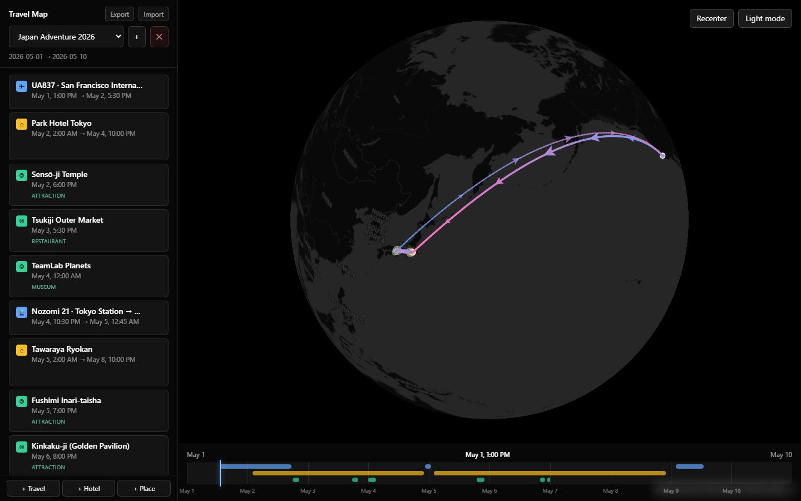

## Stack

- **React + Vite + TypeScript + Tailwind**
- **MapLibre GL** with the globe projection (CartoDB / OpenFreeMap raster tiles, no API key)
- **Photon** (OpenStreetMap geocoder) for place autocomplete
- **Overpass API** (OpenStreetMap) for nearby points of interest
- **Zustand** store backed by **Dexie** / IndexedDB — everything persists locally
- **react-day-picker** for trip date ranges

No accounts, no API keys, no servers — open the page and start planning.

## Getting started

```bash
npm install
npm run dev
```

Visit the URL Vite prints (default `http://localhost:5173/`).

---

## Features

### 1. Empty state

The app loads to an empty globe. The sidebar prompts you to create a trip; the rest is just Earth, ready to be drawn on.

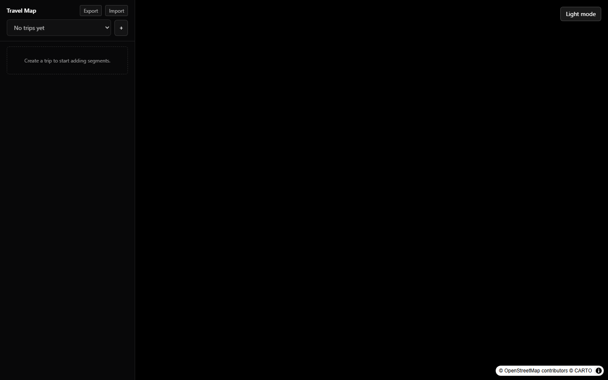

### 2. Create a trip

The `+` next to the trip selector opens the **New trip** modal. Pick a name, then either click a date range on the dual-month calendar or flip to manual `YYYY-MM-DD` inputs. The summary line above the calendar previews the range and total day count.

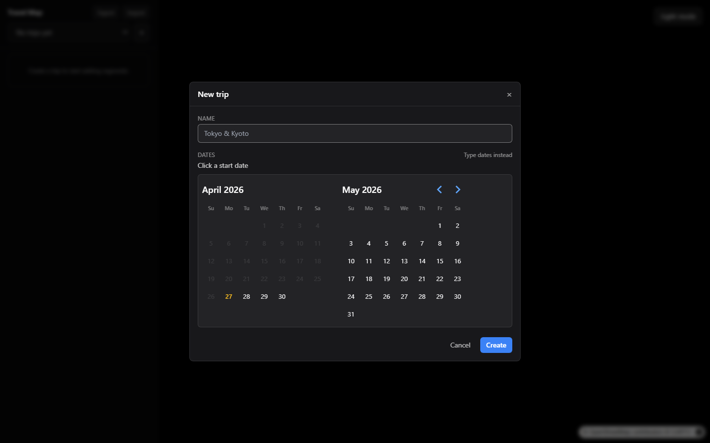

### 3. The main view

Once a trip exists you get the full layout:

- **Sidebar** (left) — trip picker, segment list, quick-add buttons.
- **Globe** (center) — flight arcs with animated direction chevrons, amber hotel markers, emerald POI markers.
- **Timeline** (bottom) — a draggable scrubber that filters which markers and arcs are visible.
- **Top-right controls** — Recenter and theme toggle.


### 4. Sidebar — segment list

Segments are sorted chronologically. Each card shows a kind icon (✈ / 🚗 / 🚆 / ⌂ / ◎), a one-line summary (`UA837 · San Francisco → Narita`), the time window, and the POI category if applicable. The bottom row has three quick-add buttons.

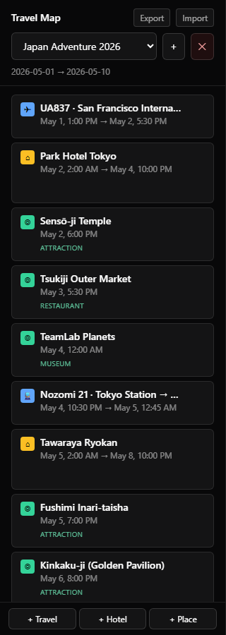

Hover a row to reveal per-segment actions: **Find Nearby** (hotels only — the ◎ icon), **Edit** (✎), and **Delete** (✕).

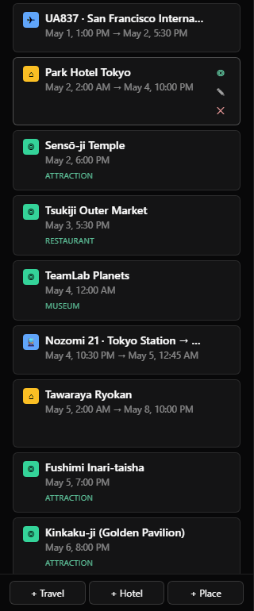

### 5. Adding segments

Three kinds of segments, each with its own form layout. The tab strip lets you switch kinds while creating a new one; when editing, the kind is locked.

#### Travel — flight, car, or train

A mode picker (✈ Flight / 🚗 Car / 🚆 Transit) controls the field labels. Origin/destination use the place autocomplete; carrier, route number, and confirmation are optional. Time fields are labeled "Depart / Arrive" for flights and "Start / End" for car/transit.

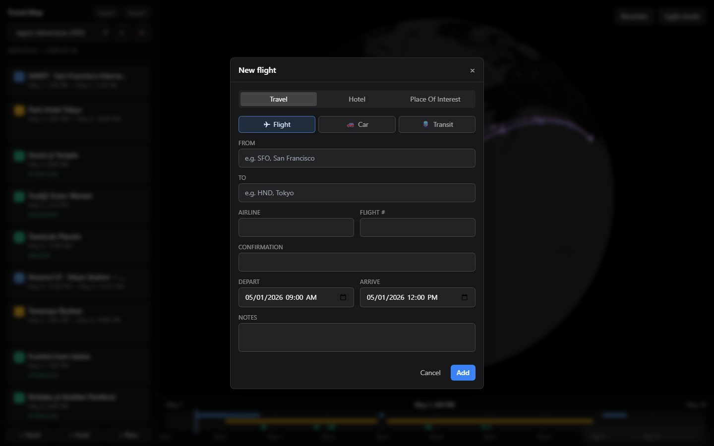

#### Hotel

A single location, optional confirmation code, and check-in / check-out timestamps. Hotels become anchors that POIs can attach to.

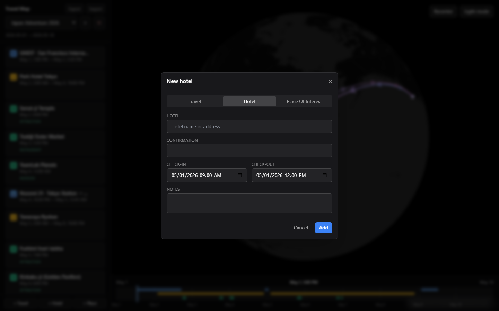

#### Place of interest

A location, a category (restaurant / cafe / bar / museum / attraction / park / shop / other), and an optional **anchor hotel** so the POI inherits the right stay window. Notes are free-text.

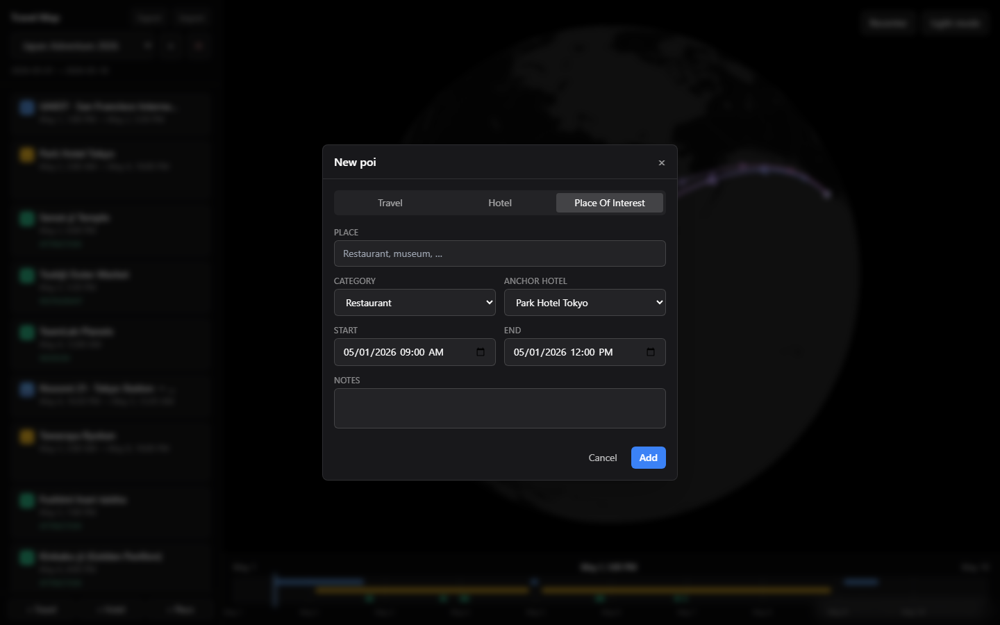

### 6. Place autocomplete (Photon)

Every location field is a typeahead that hits the [Photon](https://photon.komoot.io/) geocoder. Two characters in, it starts returning suggestions with name + full address. Selecting one collapses the input to a chip with an `×` to clear.

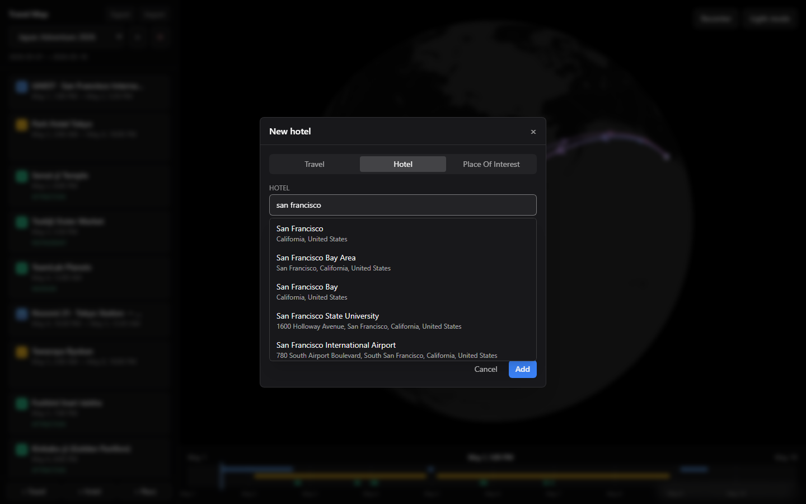

### 7. Find nearby (Overpass)

Click the ◎ on any hotel card to open the **Near \<hotel\>** panel. Toggle category chips (restaurant / cafe / bar / museum / attraction / park / shop), pick a radius (500 m / 1 km / 2 km / 5 km), and the panel queries the Overpass API. Each result has an **Add** button that creates a POI segment, automatically anchored to the hotel and slotted onto the check-in day.

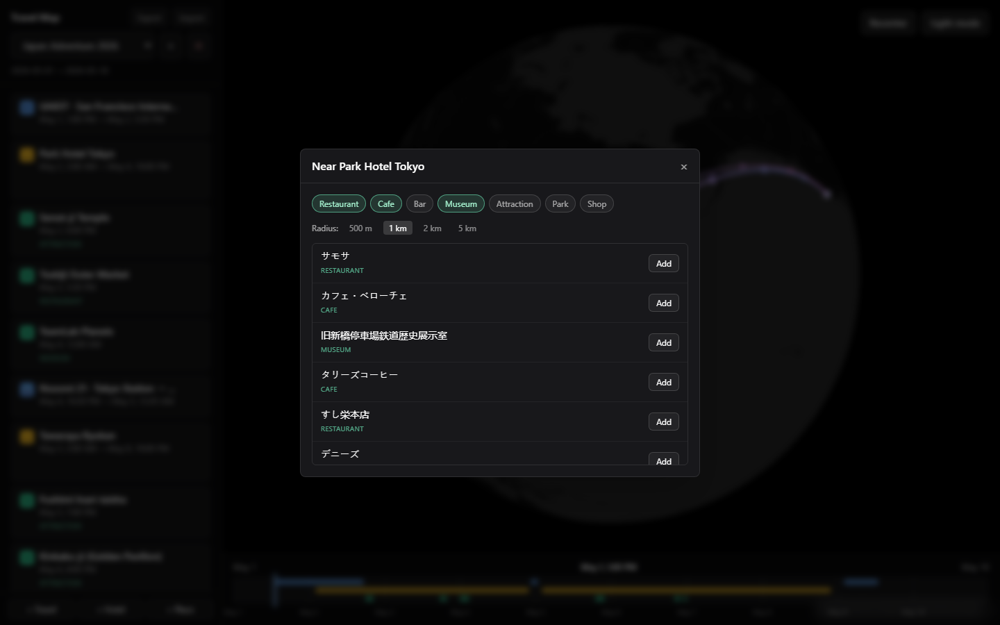

### 8. Timeline

The bottom rail is a draggable time scrubber. It shows:

- Daily grid lines with adaptive labels (every N days depending on trip length).
- Stacked bars per kind: travel on top (blue), hotels in the middle (amber), POIs on the bottom (emerald).
- A blue playhead indicating the current moment.
- The current date/time label centered above.

Drag anywhere on the rail (mouse or touch) to scrub. The globe responds in real time — only segments active at that moment stay fully lit; the rest fade.

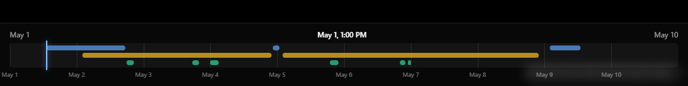

### 9. Top-right controls

- **Recenter** — fits the camera to the currently active segment, or to the whole trip if nothing is active.
- **Light / Dark mode** — swaps both the map style and the surrounding chrome.

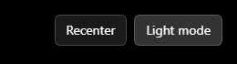

### 10. Light mode

Same data, lighter style.

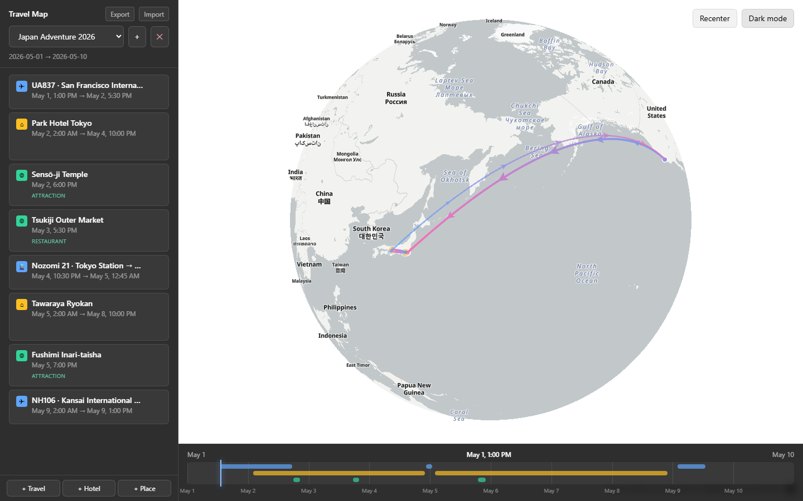

### 11. Export / Import

The header has **Export** and **Import** buttons.

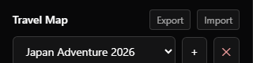

- **Export** downloads the entire local store (every trip + every segment) as a timestamped JSON file.
- **Import** opens a file picker, validates the file, and shows a preview of what overlaps with your current data. Then choose **Merge** (keep existing, overwrite by ID) or **Replace all** (wipe and load the file).

The format is stable, so exports double as backups and as a way to share trips between devices.

---

## Project layout

```
src/
  App.tsx                  Top-level layout — Globe, Sidebar, Timeline, top controls
  components/
    Globe.tsx              MapLibre globe + arcs, markers, time-driven visibility
    Sidebar.tsx            Left panel shell
    TripPicker.tsx         Trip dropdown, create/delete modals
    SegmentList.tsx        Segment cards with hover actions
    SegmentForm.tsx        Create/edit modal for travel / hotel / POI
    PlaceSearch.tsx        Photon autocomplete
    NearbyPanel.tsx        Overpass nearby-POI search
    Timeline.tsx           Draggable bottom scrubber
    DataMenu.tsx           Export / Import controls
    Modal.tsx              Reusable dialog overlay
  lib/
    store.ts               Zustand store + selectors
    db.ts                  Dexie schema (with v1 → v2 migration)
    types.ts               Trip + Segment types
    photon.ts              Photon client
    overpass.ts            Overpass client
    mapStyles.ts           Dark / light map styles
    segmentLayers.ts       MapLibre source/layer construction
    time.ts                Date/time helpers
    io.ts                  Export/import format + validation
```
